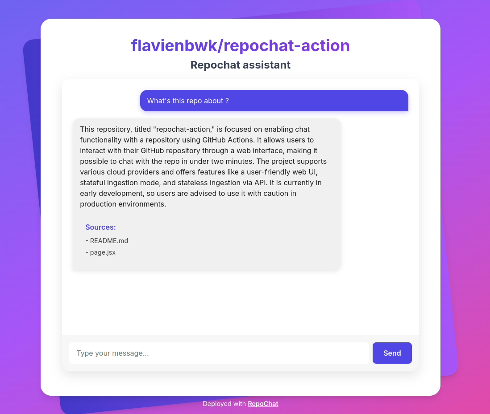

# Repochat Action

[](https://github.com/flavienbwk/repochat-action/actions/workflows/deploy.yml)
[](https://github.com/flavienbwk/repochat-action/releases/latest)
[](https://opensource.org/licenses/MIT)

> [!WARNING]
> This project is in early development and may contain bugs. Use with caution in production environments.

Chat with your repo in under 2 minutes using GitHub Actions on [supported Cloud providers](#supported-cloud-providers).

Features:

- :sparkles: A nice web UI
- :octocat: Available as a GitHub Action
- :floppy_disk: Stateful ingestion mode ([directory mode](./dir.docker-compose.yml#L6))
- :arrows_counterclockwise: Sateless ingestion via API ([api mode](./api.docker-compose.yml#L6))
- :closed_lock_with_key: Optional password on web UI



## Requirements

- A [supported cloud provider](#supported-cloud-providers) credentials ;
- An [OpenAI](https://openai.com/api/) API key.

## Usage for GitHub Actions

Easily add RepoChat to your project using GitHub Actions:

```yaml
name: "Deploy Repochat for this repo"

on:
  push:
    branches:
    - main

jobs:
  deploy:
    runs-on: ubuntu-latest
    steps:
    - uses: actions/checkout@v2
    - uses: flavienbwk/repochat-action@v0
      name: 'Deploy Repochat'
      id: deploy_repochat
      with:
        # All parameters not explicitly marked as "optional" are required
        dirs_to_scan: "."  # comma-separated glob dirs to analyze
        interface_password: ${{ secrets.INTERFACE_PASSWORD }}  # optional
        openai_api_key: ${{ secrets.OPENAI_API_KEY }}
        openai_model_type_inference: "gpt-4o-mini"
        openai_model_type_embedding : "text-embedding-3-small"
        provider_name: 'scaleway'
        provider_key_id: ${{ secrets.PROVIDER_KEY_ID }}
        provider_key_secret: ${{ secrets.PROVIDER_KEY_SECRET }}
        provider_project_id: ${{ secrets.PROVIDER_PROJECT_ID }}
        provider_default_region: 'fr-par'
        provider_default_zone: 'fr-par-2'

    - name: Get repochat domain
      run: echo "DOMAIN=${{ steps.deploy_repochat.outputs.domain }}" >> $GITHUB_OUTPUT
      id: repochat_domain
```

Get a practical implementation example with [`.github/workflows/deploy.yml`](./.github/workflows/deploy.yml).

You can restrict your OpenAI API key permissions to:

- Models: `Read`
- Model capabilities: `Write`

### Supported Cloud providers

- **[Scaleway](https://www.scaleway.com/en/)**
  - Refer to [Scaleway's documentation to generate API keys](https://www.scaleway.com/en/docs/identity-and-access-management/iam/how-to/create-api-keys/).
  - Additional required parameters:

    ```txt
    provider_name: 'scaleway'
    provider_key_id: ${{ secrets.PROVIDER_KEY_ID }}
    provider_key_secret: ${{ secrets.PROVIDER_KEY_SECRET }}
    provider_project_id: ${{ secrets.PROVIDER_PROJECT_ID }}
    provider_default_region: 'fr-par'  # example
    provider_default_zone: 'fr-par-2'  # example
    ```

  - Policies: ContainersFullAccess, ServerlessJobsFullAccess, FunctionsFullAccess

## Other deployments

### Deploy for local directory

<details>
<summary>👉 Deploy locally for directory serving...</summary>

1. Copy repo/documents/files to be ingested under `./api/example/`

2. Copy and update env variables

    ```bash
    cp .env.example .env
    ```

3. Run the Docker container

    ```bash
    docker compose -f dir.docker-compose.yml up -d
    ```

4. Access the app at `http://localhost:3001`

</details>

### Deploy as stateless API

<details>
<summary>👉 Deploy locally as a stateless API...</summary>

1. Copy and update env variables

    ```bash
    cp .env.example .env
    ```

2. Run the Docker container

    ```bash
    docker compose -f api.docker-compose.yml up -d
    ```

3. Inject data taking example on the [Python](./scripts/ingest-docs-api.py) or [JS](./scripts/ingest-docs-api.js) scripts

4. Access the app at `http://localhost:3001`

</details>

## Development

<details>
<summary>👉 Run RepoChat for development...</summary>

1. Clone this repo

    ```bash
    git@github.com:flavienbwk/repochat-action.git
    ```

2. Copy and update env variables

    ```bash
    cp .env.example .env
    ```

3. Run the local stack

    ```bash
    make dev
    ```

</details>

## Release Action

1. Increase repochat's version in `./package.json`

2. Run build and commit latest edits:

    ```bash
    npm run build
    # git add && git commit && git push...
    ```

3. Merge on `main`

    This will create a release based on `package.json` and push the `:latest` Docker image.

## Features

- [x] Directory data chat
- [x] API data chat
- [x] GitHub Actions release
- [x] Secure ingestion endpoint (/api/ingest)
- [x] Secure RepoChat with optional password
- [x] Maintain state over PG

## Why not use Vercel ?

Vercel is very limited when it comes to deploying everything but JS. First, ChromaDB (and any sqlite-based library) [is not supported in Vercel](https://vercel.community/t/is-vercel-incompatible-with-chromadb-sqlite/787). Then, this project uses a FastAPI Python API that requires more storage than [Vercel's 250MB bundle limit](https://vercel.com/docs/functions/runtimes#bundle-size-limits).
